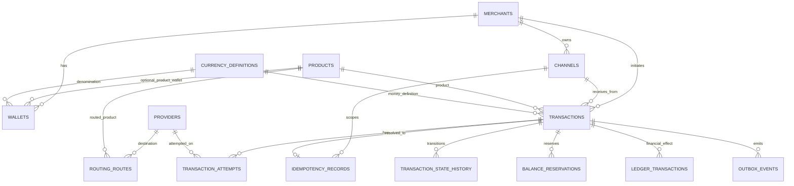
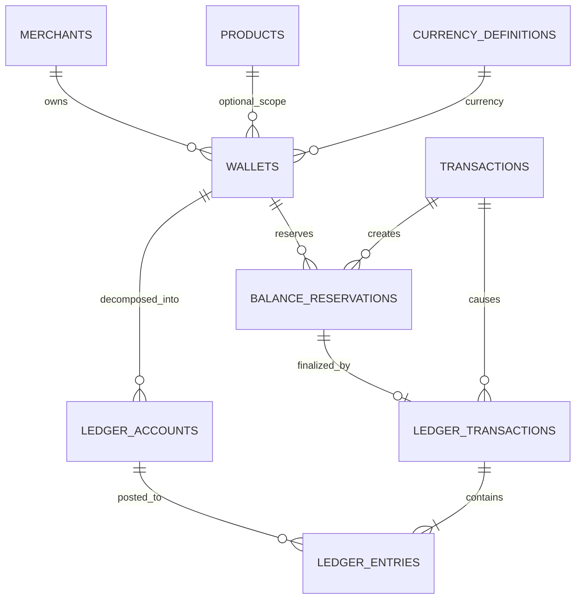
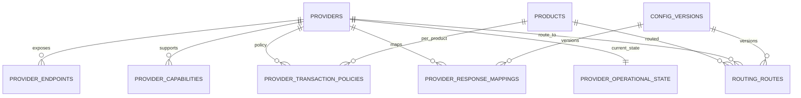
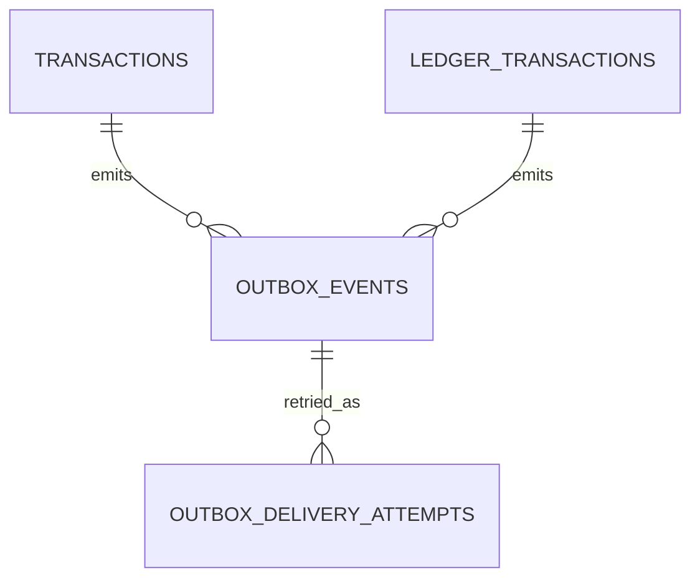
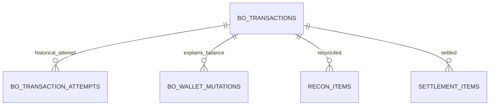
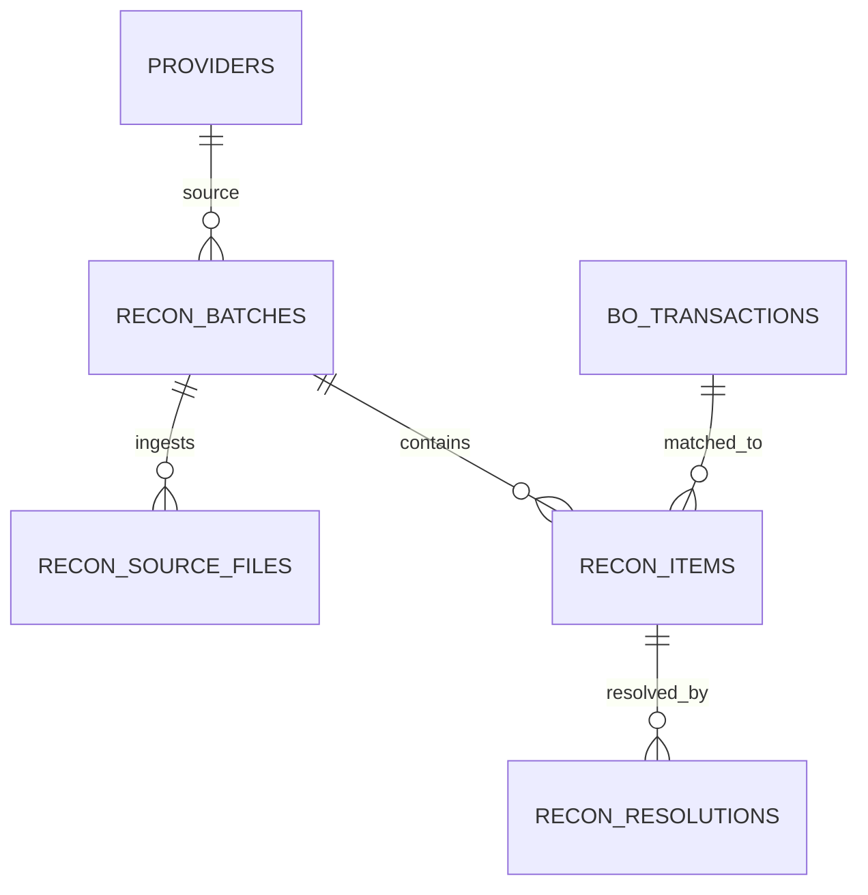
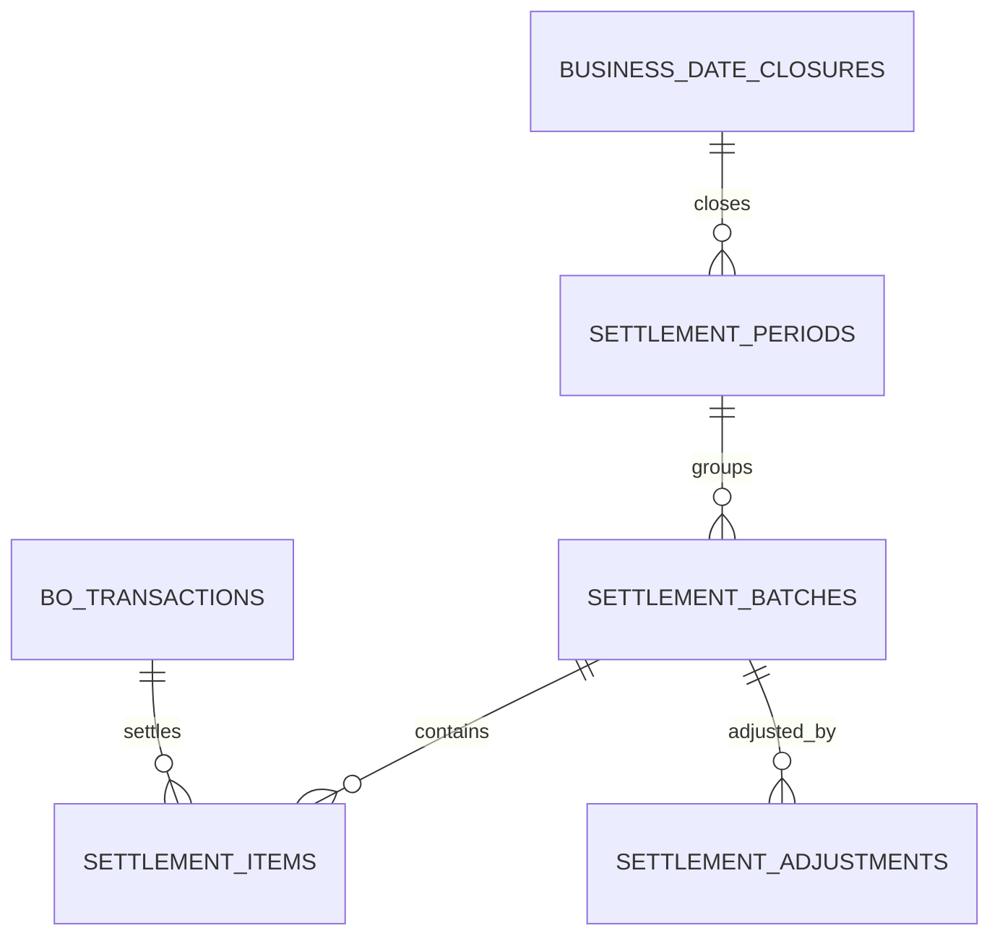
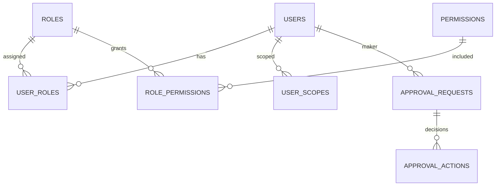
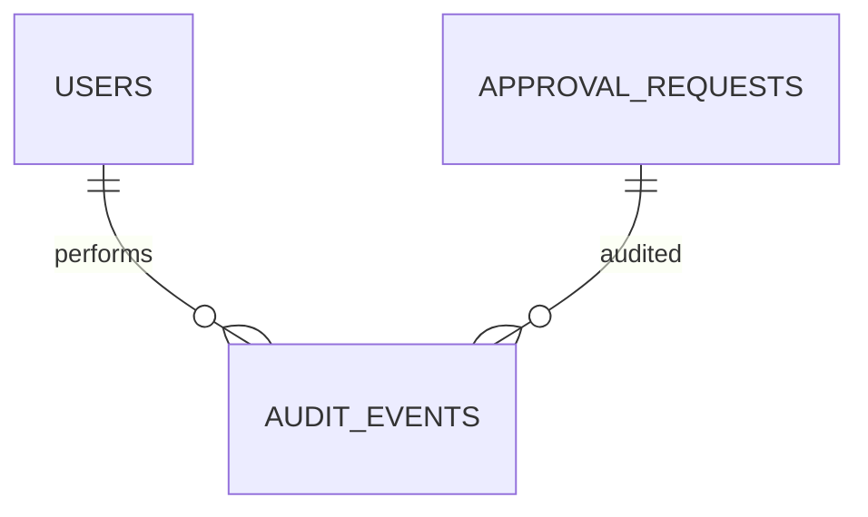

# RANSYS Database ERD v1.0

**Document Type:** Detailed Engineering Design — Database ERD  
**Product:** RANSYS Universal Transaction Switching & Processing Platform  
**Primary Database:** PostgreSQL  
**Status:** Draft v1 for engineering review  
**Source:** RANSYS PRD v1.0 / Architecture decisions Round 1–12

---

## 1. Purpose

Dokumen ini mendefinisikan Database ERD v1 untuk RANSYS dengan fokus utama pada financial consistency, prefund wallet + reserve/hold, immutable ledger, idempotency, transaction attempt history, provider/routing configuration, transactional outbox, Backoffice replication, reconciliation, settlement, maker-checker, dan audit trail.

ERD dipisah menjadi beberapa bounded context agar Transaction Database tetap fokus pada online processing dan tidak berubah menjadi reporting database.

---

# 2. Physical Database Boundary

RANSYS baseline menggunakan **dua physical database utama**.

```text
+------------------------------------------------------+
|              RANSYS TRANSACTION DATABASE             |
|------------------------------------------------------|
| core schema                                          |
| ledger schema                                        |
| integration schema                                   |
| config schema                                        |
| async schema                                         |
|                                                      |
| Hot transaction retention: +/- 3 minggu              |
| Financial source of truth                            |
+----------------------------+-------------------------+
                             |
                             | Outbox / Replication
                             | target freshness <= 5m
                             v
+------------------------------------------------------+
|               RANSYS BACKOFFICE DATABASE             |
|------------------------------------------------------|
| bo schema                                            |
| recon schema                                         |
| settlement schema                                    |
| iam schema                                           |
| audit schema                                         |
|                                                      |
| Historical retention >= 2 tahun                     |
| Reporting / Ops / Recon / Settlement / Audit        |
+------------------------------------------------------+
```

**Rule:** Tidak ada cross-database foreign key antara Transaction DB dan Backoffice DB. Relasi antar-database menggunakan immutable identifier seperti `ransys_transaction_id`, `wallet_id`, `provider_id`, `ledger_transaction_id`, atau `event_id`.

---

# 3. PostgreSQL Schema Layout

## Transaction Database

```text
core
ledger
integration
config
async
```

## Backoffice Database

```text
bo
recon
settlement
iam
audit
```

---

# 4. Identifier Strategy

Baseline proposal:

| Entity | ID |
|---|---|
| Transaction | UUIDv7 |
| Transaction Attempt | UUIDv7 |
| Ledger Transaction | UUIDv7 |
| Ledger Entry | UUIDv7 |
| Reservation | UUIDv7 |
| Outbox Event | UUIDv7 |
| Provider / Product / Merchant / Wallet | UUID |
| Recon / Settlement Batch | UUIDv7 |

`ransys_transaction_id` menjadi correlation identity utama end-to-end.

> UUIDv7 adalah proposal ERD v1 karena time-sortable. Contract tetap bisa dipertahankan jika tim kemudian memilih identifier scheme lain.

---

# 5. Core Transaction ERD



---

# 6. `core.merchants`

| Column | Type | Constraint / Notes |
|---|---|---|
| `merchant_id` | UUID | PK |
| `merchant_code` | VARCHAR(64) | UNIQUE, NOT NULL |
| `merchant_name` | VARCHAR(200) | NOT NULL |
| `status` | VARCHAR(32) | ACTIVE / INACTIVE / SUSPENDED |
| `default_wallet_id` | UUID | nullable logical ref |
| `created_at` | TIMESTAMPTZ | NOT NULL |
| `updated_at` | TIMESTAMPTZ | NOT NULL |

---

# 7. `core.channels`

| Column | Type | Constraint / Notes |
|---|---|---|
| `channel_id` | UUID | PK |
| `merchant_id` | UUID | FK -> merchants |
| `channel_code` | VARCHAR(64) | NOT NULL |
| `channel_type` | VARCHAR(32) | REST / SOAP / ISO8583 / TCP |
| `status` | VARCHAR(32) | ACTIVE / INACTIVE |
| `auth_profile` | VARCHAR(64) | SIGNED_API / MTLS / future |
| `created_at` | TIMESTAMPTZ | NOT NULL |
| `updated_at` | TIMESTAMPTZ | NOT NULL |

Constraint:

```text
UNIQUE (merchant_id, channel_code)
```

---

# 8. `core.products`

| Column | Type | Notes |
|---|---|---|
| `product_id` | UUID | PK |
| `product_code` | VARCHAR(64) | UNIQUE |
| `product_name` | VARCHAR(200) | NOT NULL |
| `category` | VARCHAR(64) | PLN / PULSA / TRANSFER / VA / etc |
| `status` | VARCHAR(32) | ACTIVE / INACTIVE |
| `metadata_schema` | JSONB | optional extension validation |
| `created_at` | TIMESTAMPTZ | NOT NULL |
| `updated_at` | TIMESTAMPTZ | NOT NULL |

---

# 9. `core.currency_definitions`

Versioned currency definition agar redenomination-ready.

| Column | Type | Notes |
|---|---|---|
| `currency_definition_id` | UUID | PK |
| `currency_code` | CHAR(3) | e.g. IDR |
| `version_no` | INT | NOT NULL |
| `scale` | SMALLINT | NOT NULL |
| `conversion_ratio` | NUMERIC(24,8) | nullable |
| `effective_from` | TIMESTAMPTZ | NOT NULL |
| `effective_until` | TIMESTAMPTZ | nullable |
| `status` | VARCHAR(32) | ACTIVE / SCHEDULED / EXPIRED |
| `created_at` | TIMESTAMPTZ | NOT NULL |

Constraint:

```text
UNIQUE(currency_code, version_no)
```

Historical transaction selalu menunjuk definition version yang berlaku saat transaksi dibuat.

---

# 10. `core.transactions`

Business transaction utama.

| Column | Type | Notes |
|---|---|---|
| `ransys_transaction_id` | UUID | PK |
| `merchant_id` | UUID | FK |
| `channel_id` | UUID | FK |
| `product_id` | UUID | FK |
| `transaction_type` | VARCHAR(32) | PAYMENT / INQUIRY / TRANSFER / REFUND / REVERSAL / etc |
| `client_reference` | VARCHAR(128) | mandatory financial |
| `idempotency_key` | VARCHAR(128) | nullable per contract |
| `transaction_fingerprint` | VARCHAR(128) | NOT NULL |
| `original_transaction_id` | UUID | self ref, nullable |
| `amount` | NUMERIC(24,6) | NOT NULL |
| `currency_definition_id` | UUID | FK |
| `merchant_fee_amount` | NUMERIC(24,6) | default 0 |
| `total_reserve_amount` | NUMERIC(24,6) | amount + guaranteed fee |
| `processing_status` | VARCHAR(32) | RECEIVED / VALIDATED / PROCESSING / PENDING / IN_DOUBT / SUCCESS / FAILED / ... |
| `financial_status` | VARCHAR(32) | NONE / RESERVED / POSTED / RELEASED / REVERSED / REFUNDED |
| `settlement_status` | VARCHAR(32) | PENDING / READY / SETTLED / ADJUSTED |
| `reconciliation_status` | VARCHAR(32) | UNMATCHED / MATCHED / EXCEPTION / RESOLVED |
| `ransys_response_code` | CHAR(4) | canonical response |
| `reason_code` | VARCHAR(64) | nullable |
| `reason_description` | VARCHAR(500) | nullable |
| `initial_selected_provider_id` | UUID | nullable |
| `actual_provider_id` | UUID | nullable |
| `routing_rule_version` | BIGINT | nullable |
| `config_version` | BIGINT | nullable |
| `metadata` | JSONB | extension only |
| `received_at` | TIMESTAMPTZ | NOT NULL |
| `validated_at` | TIMESTAMPTZ | nullable |
| `financial_posted_at` | TIMESTAMPTZ | nullable |
| `completed_at` | TIMESTAMPTZ | nullable |
| `updated_at` | TIMESTAMPTZ | NOT NULL |
| `row_version` | BIGINT | concurrency/diagnostic version |

Critical indexes:

```text
INDEX (merchant_id, received_at DESC)
INDEX (channel_id, client_reference)
INDEX (product_id, received_at DESC)
INDEX (processing_status, received_at)
INDEX (reconciliation_status, received_at)
INDEX (actual_provider_id, received_at)
INDEX (original_transaction_id)
INDEX (ransys_response_code, received_at)
```

`client_reference` tidak diberi unique constraint permanen pada table ini karena idempotency baseline adalah 24 jam.

---

# 11. `core.idempotency_records`

| Column | Type | Notes |
|---|---|---|
| `idempotency_record_id` | UUID | PK |
| `channel_id` | UUID | FK |
| `client_reference` | VARCHAR(128) | NOT NULL |
| `idempotency_key` | VARCHAR(128) | nullable |
| `fingerprint` | VARCHAR(128) | NOT NULL |
| `ransys_transaction_id` | UUID | FK |
| `active` | BOOLEAN | default TRUE |
| `created_at` | TIMESTAMPTZ | NOT NULL |
| `expires_at` | TIMESTAMPTZ | NOT NULL |
| `expired_at` | TIMESTAMPTZ | nullable |

Partial unique index:

```sql
CREATE UNIQUE INDEX ux_idempotency_active_reference
ON core.idempotency_records(channel_id, client_reference)
WHERE active = true;
```

Behavior:

```text
same reference + same fingerprint      -> return existing
same reference + different fingerprint -> DUPLICATE_REFERENCE_CONFLICT
```

Expiration worker mengubah `active=false` setelah 24 jam.

---

# 12. `core.transaction_attempts`

Satu business transaction dapat memiliki banyak provider/network attempt.

| Column | Type | Notes |
|---|---|---|
| `transaction_attempt_id` | UUID | PK |
| `ransys_transaction_id` | UUID | FK |
| `attempt_no` | INT | NOT NULL |
| `attempt_type` | VARCHAR(32) | PURCHASE / INQUIRY / STATUS_CHECK / REVERSAL / REFUND / ADVICE |
| `provider_id` | UUID | FK |
| `request_sent` | BOOLEAN | menentukan failover safety |
| `transport_status` | VARCHAR(32) | NOT_SENT / SENT / RESPONSE / TIMEOUT / CONNECTION_ERROR |
| `provider_transaction_status` | VARCHAR(32) | nullable |
| `ransys_response_code` | CHAR(4) | nullable |
| `provider_response_code` | VARCHAR(64) | nullable |
| `provider_response_message` | VARCHAR(500) | nullable |
| `provider_reference` | VARCHAR(128) | nullable |
| `provider_stan` | VARCHAR(32) | nullable |
| `provider_rrn` | VARCHAR(64) | nullable |
| `latency_ms` | INT | nullable |
| `raw_request_reference` | VARCHAR(500) | nullable |
| `raw_response_reference` | VARCHAR(500) | nullable |
| `correlation_id` | VARCHAR(128) | NOT NULL |
| `trace_id` | VARCHAR(128) | NOT NULL |
| `provider_sent_at` | TIMESTAMPTZ | nullable |
| `provider_response_at` | TIMESTAMPTZ | nullable |
| `created_at` | TIMESTAMPTZ | NOT NULL |
| `metadata` | JSONB | optional |

Constraint:

```text
UNIQUE(ransys_transaction_id, attempt_no)
```

Indexes:

```text
INDEX(provider_id, created_at DESC)
INDEX(provider_reference)
INDEX(provider_rrn)
INDEX(provider_stan)
INDEX(transport_status, created_at)
```

---

# 13. `core.transaction_state_history`

Append-only state transition history.

| Column | Type | Notes |
|---|---|---|
| `history_id` | UUID | PK |
| `ransys_transaction_id` | UUID | FK |
| `transaction_attempt_id` | UUID | nullable |
| `previous_status` | VARCHAR(32) | nullable |
| `new_status` | VARCHAR(32) | NOT NULL |
| `reason_code` | VARCHAR(64) | nullable |
| `reason_description` | VARCHAR(500) | nullable |
| `change_source` | VARCHAR(32) | CORE / PROVIDER / RECON / MANUAL / CALLBACK |
| `created_at` | TIMESTAMPTZ | NOT NULL |

Historical transition tidak di-update.

---

# 14. Ledger & Wallet ERD



---

# 15. `ledger.wallets`

Current wallet projection/cache untuk keputusan balance secara cepat dan atomic.

| Column | Type | Notes |
|---|---|---|
| `wallet_id` | UUID | PK |
| `merchant_id` | UUID | FK |
| `product_id` | UUID | nullable future product wallet |
| `currency_definition_id` | UUID | FK |
| `ledger_balance` | NUMERIC(24,6) | NOT NULL DEFAULT 0 |
| `available_balance` | NUMERIC(24,6) | NOT NULL DEFAULT 0 |
| `reserved_balance` | NUMERIC(24,6) | NOT NULL DEFAULT 0 |
| `status` | VARCHAR(32) | ACTIVE / FROZEN / CLOSED |
| `version_no` | BIGINT | NOT NULL |
| `created_at` | TIMESTAMPTZ | NOT NULL |
| `updated_at` | TIMESTAMPTZ | NOT NULL |

Constraints:

```text
CHECK available_balance >= 0
CHECK reserved_balance >= 0
```

Financial lock:

```sql
SELECT *
FROM ledger.wallets
WHERE wallet_id = :wallet_id
FOR UPDATE;
```

Provider network call harus terjadi **setelah COMMIT dan lock dilepas**.

---

# 16. `ledger.balance_reservations`

| Column | Type | Notes |
|---|---|---|
| `reservation_id` | UUID | PK |
| `wallet_id` | UUID | FK |
| `ransys_transaction_id` | UUID | FK |
| `amount` | NUMERIC(24,6) | principal |
| `fee_amount` | NUMERIC(24,6) | guaranteed merchant fee |
| `total_reserved_amount` | NUMERIC(24,6) | amount + fee |
| `status` | VARCHAR(32) | ACTIVE / COMMITTED / RELEASED |
| `hold_reason` | VARCHAR(64) | TRANSACTION_PROCESSING / IN_DOUBT |
| `created_at` | TIMESTAMPTZ | NOT NULL |
| `committed_at` | TIMESTAMPTZ | nullable |
| `released_at` | TIMESTAMPTZ | nullable |
| `warning_at` | TIMESTAMPTZ | nullable |
| `critical_at` | TIMESTAMPTZ | nullable |

Rule:

```text
No auto-release based only on age.
```

---

# 17. `ledger.ledger_accounts`

Double-entry accounting account master.

| Column | Type | Notes |
|---|---|---|
| `ledger_account_id` | UUID | PK |
| `account_code` | VARCHAR(100) | UNIQUE |
| `account_name` | VARCHAR(200) | NOT NULL |
| `owner_type` | VARCHAR(32) | MERCHANT / PROVIDER / RANSYS / CLEARING |
| `owner_id` | UUID | nullable logical owner |
| `wallet_id` | UUID | nullable |
| `account_type` | VARCHAR(64) | AVAILABLE / RESERVED / PROVIDER_PAYABLE / RANSYS_REVENUE / CLEARING / ADJUSTMENT |
| `currency_definition_id` | UUID | FK |
| `normal_side` | CHAR(1) | D / C |
| `status` | VARCHAR(32) | ACTIVE / CLOSED |
| `created_at` | TIMESTAMPTZ | NOT NULL |

---

# 18. `ledger.ledger_transactions`

Immutable ledger posting header.

| Column | Type | Notes |
|---|---|---|
| `ledger_transaction_id` | UUID | PK |
| `ransys_transaction_id` | UUID | nullable FK |
| `reservation_id` | UUID | nullable |
| `operation_type` | VARCHAR(64) | RESERVE / POST / RELEASE / TOPUP / REFUND / REVERSAL / ADJUSTMENT / SETTLEMENT |
| `business_reference` | VARCHAR(128) | NOT NULL |
| `description` | VARCHAR(500) | NOT NULL |
| `status` | VARCHAR(32) | POSTED / REVERSED_BY_COMPENSATION |
| `effective_at` | TIMESTAMPTZ | NOT NULL |
| `created_at` | TIMESTAMPTZ | NOT NULL |
| `created_by_type` | VARCHAR(32) | SYSTEM / USER / RECON |
| `created_by_id` | UUID | nullable |
| `compensates_ledger_transaction_id` | UUID | nullable self-ref |

Correction tidak mengubah posting lama; buat compensating transaction baru.

---

# 19. `ledger.ledger_entries`

| Column | Type | Notes |
|---|---|---|
| `ledger_entry_id` | UUID | PK |
| `ledger_transaction_id` | UUID | FK |
| `ledger_account_id` | UUID | FK |
| `entry_side` | CHAR(1) | D / C |
| `amount` | NUMERIC(24,6) | > 0 |
| `currency_definition_id` | UUID | FK |
| `entry_sequence` | SMALLINT | NOT NULL |
| `created_at` | TIMESTAMPTZ | NOT NULL |

Constraints:

```text
CHECK amount > 0
UNIQUE(ledger_transaction_id, entry_sequence)
```

Mandatory posting invariant:

```text
SUM(DEBIT) == SUM(CREDIT)
```

Direkomendasikan memakai controlled posting function/service dan deferred validation, bukan arbitrary INSERT dari aplikasi.

---

# 20. Wallet Projection Invariant

```text
Opening Balance
+ SUM(all effective ledger postings)
= Current Ledger Balance
```

Periodic integrity checker harus menghasilkan alert bila terdapat mismatch:

```text
WALLET_LEDGER_PROJECTION_MISMATCH
```

---

# 21. Financial Transaction Flow

## Reserve

```text
Amount = 100,000
Fee    =   2,500
Hold   = 102,500
```

Atomic DB transaction:

```text
1. lock wallet
2. validate available >= 102,500
3. create transaction
4. create reservation
5. available -= 102,500
6. reserved  += 102,500
7. create ledger RESERVE posting
8. create outbox event
9. COMMIT
```

## Provider SUCCESS

```text
1. lock transaction
2. lock wallet
3. reservation ACTIVE -> COMMITTED
4. reserved -= hold
5. ledger_balance -= hold
6. ledger POST posting
7. transaction -> SUCCESS / POSTED
8. outbox event
9. COMMIT
```

## Provider FAILED

```text
reservation -> RELEASED
reserved  -= hold
available += hold
ledger RELEASE posting
transaction -> FAILED
```

## Provider TIMEOUT

```text
transaction -> IN_DOUBT
reservation stays ACTIVE
available remains reduced
reserved remains held
no automatic release
create recovery event
```

---

# 22. Provider & Routing ERD



---

# 23. `integration.providers`

```text
provider_id UUID PK
provider_code VARCHAR(64) UNIQUE
provider_name VARCHAR(200)
provider_type VARCHAR(64)
adapter_service_name VARCHAR(128)
protocol_type VARCHAR(32)
status VARCHAR(32)
created_at TIMESTAMPTZ
updated_at TIMESTAMPTZ
```

1 logical provider = 1 independently deployable adapter.

---

# 24. `integration.provider_endpoints`

```text
provider_endpoint_id UUID PK
provider_id UUID FK
environment VARCHAR(32) -- PROD/UAT/DR
endpoint_type VARCHAR(32) -- API/TCP/SFTP/CALLBACK
host_or_url VARCHAR(500)
port INT nullable
secret_reference VARCHAR(256)
status VARCHAR(32)
created_at TIMESTAMPTZ
```

Credential actual tidak disimpan di table ini; gunakan reference ke `ISecretProvider`.

---

# 25. `integration.provider_capabilities`

```text
provider_id UUID FK
capability_code VARCHAR(64)
enabled BOOLEAN
config JSONB nullable
updated_at TIMESTAMPTZ
PRIMARY KEY(provider_id, capability_code)
```

Capability examples:

```text
INQUIRY
PAYMENT
PURCHASE
STATUS_CHECK
REVERSAL
REFUND
ADVICE
CALLBACK
BALANCE_CHECK
RECONCILIATION
SETTLEMENT_FILE
```

---

# 26. `integration.provider_transaction_policies`

Configurable per Provider + Product + Transaction Type.

```text
policy_id UUID PK
provider_id UUID FK
product_id UUID FK
transaction_type VARCHAR(32)
connect_timeout_ms INT
read_timeout_ms INT
max_retry SMALLINT
retry_delay_ms INT
retry_backoff_type VARCHAR(32)
status_check_after_timeout BOOLEAN
reversal_after_timeout BOOLEAN
max_concurrent_requests INT nullable
max_queue_depth INT nullable
rate_limit_per_second INT nullable
effective_from TIMESTAMPTZ
effective_until TIMESTAMPTZ nullable
version_no BIGINT
```

---

# 27. `integration.provider_response_mappings`

```text
mapping_id UUID PK
provider_id UUID FK
transaction_type VARCHAR(32) nullable
provider_response_code VARCHAR(64)
ransys_response_code CHAR(4)
normalized_status VARCHAR(32)
description VARCHAR(500)
config_version_id UUID FK
effective_from TIMESTAMPTZ
effective_until TIMESTAMPTZ nullable
```

Raw provider response tetap disimpan di TransactionAttempt.

---

# 28. `integration.provider_operational_state`

```text
provider_id UUID PK
manual_enabled BOOLEAN
manual_disable_reason VARCHAR(500) nullable
manual_disabled_until TIMESTAMPTZ nullable
health_state VARCHAR(32) -- HEALTHY/DEGRADED/UNHEALTHY
circuit_state VARCHAR(32) -- CLOSED/OPEN/HALF_OPEN
state_changed_at TIMESTAMPTZ
updated_at TIMESTAMPTZ
```

Time-series metric tidak disimpan di sini; gunakan observability platform/cache.

---

# 29. `config.config_versions`

```text
config_version_id UUID PK
config_domain VARCHAR(64)
version_no BIGINT
status VARCHAR(32)
effective_from TIMESTAMPTZ nullable
effective_until TIMESTAMPTZ nullable
created_by UUID
approved_by UUID nullable
created_at TIMESTAMPTZ
approved_at TIMESTAMPTZ nullable
activated_at TIMESTAMPTZ nullable
```

Lifecycle:

```text
DRAFT -> PENDING_APPROVAL -> APPROVED -> SCHEDULED -> ACTIVE -> EXPIRED
```

---

# 30. `config.routing_routes`

Deterministic priority routing only pada v1.

```text
routing_route_id UUID PK
config_version_id UUID FK
product_id UUID FK
transaction_type VARCHAR(32) nullable
provider_id UUID FK
priority SMALLINT
enabled BOOLEAN
created_at TIMESTAMPTZ
```

Constraints:

```text
UNIQUE(config_version_id, product_id, transaction_type, priority)
UNIQUE(config_version_id, product_id, transaction_type, provider_id)
```

Tidak ada `weight` di v1.

---

# 31. `config.fee_rules`

Fee harus diketahui sebelum provider call.

```text
fee_rule_id UUID PK
config_version_id UUID FK
merchant_id UUID nullable
product_id UUID FK
transaction_type VARCHAR(32)
fee_type VARCHAR(32) -- FIXED/PERCENTAGE
fee_value NUMERIC(24,8)
minimum_fee NUMERIC(24,6) nullable
maximum_fee NUMERIC(24,6) nullable
currency_definition_id UUID FK
effective_from TIMESTAMPTZ
effective_until TIMESTAMPTZ nullable
```

Actual calculated fee selalu dipersist pada `core.transactions` agar historical transaction tidak berubah ketika rule berubah.

---

# 32. Async / Outbox ERD



---

# 33. `async.outbox_events`

```text
event_id UUID PK
aggregate_type VARCHAR(64)
aggregate_id UUID
event_type VARCHAR(128)
event_version INT
payload JSONB
status VARCHAR(32) -- PENDING/PROCESSING/PUBLISHED/DEAD
retry_count INT
next_retry_at TIMESTAMPTZ nullable
locked_by VARCHAR(128) nullable
locked_at TIMESTAMPTZ nullable
created_at TIMESTAMPTZ
published_at TIMESTAMPTZ nullable
```

Critical index:

```text
INDEX(status, next_retry_at, created_at)
```

Worker claim:

```sql
SELECT event_id
FROM async.outbox_events
WHERE status = 'PENDING'
  AND (next_retry_at IS NULL OR next_retry_at <= now())
ORDER BY created_at
FOR UPDATE SKIP LOCKED
LIMIT :batch_size;
```

Outbox row dibuat dalam DB transaction yang sama dengan financial state mutation.

---

# 34. `async.outbox_delivery_attempts`

```text
delivery_attempt_id UUID PK
event_id UUID FK
attempt_no INT
transport VARCHAR(32) -- DIRECT_WORKER/RABBITMQ
result VARCHAR(32) -- SUCCESS/FAILED
error_code VARCHAR(64) nullable
error_message VARCHAR(1000) nullable
started_at TIMESTAMPTZ
completed_at TIMESTAMPTZ nullable
```

---

# 35. Backoffice Historical Transaction ERD



Backoffice tidak menjadi financial source of truth.

---

# 36. `bo.transactions`

Historical/search projection minimal berisi:

```text
ransys_transaction_id PK
merchant_id
merchant_code
channel_id
product_id
transaction_type
client_reference
amount
currency_code
currency_definition_version
merchant_fee_amount
processing_status
financial_status
settlement_status
reconciliation_status
ransys_response_code
reason_code
initial_selected_provider_id
actual_provider_id
provider_reference
stan
rrn
received_at
financial_posted_at
completed_at
source_version
replicated_at
metadata
```

Search indexes baseline:

```text
client_reference
provider_reference
STAN
RRN
customer identifier/searchable representation
amount
received_at
processing_status
product_id
merchant_id
```

Backoffice boleh memiliki indexing lebih agresif daripada Core DB.

---

# 37. `bo.transaction_attempts`

Historical projection `core.transaction_attempts` untuk:

- operational investigation;
- provider latency analysis;
- failover audit;
- raw message reference lookup.

---

# 38. `bo.wallet_mutations`

Human-readable balance movement projection.

```text
wallet_mutation_id UUID PK
wallet_id UUID
ransys_transaction_id UUID nullable
ledger_transaction_id UUID
mutation_type VARCHAR(64)
amount NUMERIC(24,6)
available_before NUMERIC(24,6) nullable
available_after NUMERIC(24,6) nullable
reserved_before NUMERIC(24,6) nullable
reserved_after NUMERIC(24,6) nullable
ledger_balance_before NUMERIC(24,6) nullable
ledger_balance_after NUMERIC(24,6) nullable
reason VARCHAR(500)
effective_at TIMESTAMPTZ
```

Ini reporting projection, bukan financial source of truth.

---

# 39. Reconciliation ERD



---

# 40. `recon.recon_batches`

```text
recon_batch_id UUID PK
provider_id UUID
recon_type VARCHAR(32) -- REALTIME/PERIODIC/DAILY/T1/MANUAL
business_date DATE
status VARCHAR(32)
source_type VARCHAR(32) -- API/SFTP/CSV/TXT/XLSX/ISO
started_at TIMESTAMPTZ
completed_at TIMESTAMPTZ nullable
created_at TIMESTAMPTZ
```

---

# 41. `recon.recon_source_files`

```text
recon_source_file_id UUID PK
recon_batch_id UUID FK
file_name VARCHAR(500) nullable
file_reference VARCHAR(1000)
checksum VARCHAR(128)
record_count BIGINT nullable
received_at TIMESTAMPTZ
```

---

# 42. `recon.recon_items`

```text
recon_item_id UUID PK
recon_batch_id UUID FK
ransys_transaction_id UUID nullable
provider_reference VARCHAR(128) nullable
provider_rrn VARCHAR(64) nullable
provider_stan VARCHAR(32) nullable
ransys_amount NUMERIC(24,6) nullable
provider_amount NUMERIC(24,6) nullable
ransys_status VARCHAR(32) nullable
provider_status VARCHAR(32) nullable
recon_result VARCHAR(64)
deterministic_resolution_allowed BOOLEAN
created_at TIMESTAMPTZ
```

`recon_result` supports:

```text
MATCHED
RANSYS_ONLY
PROVIDER_ONLY
AMOUNT_MISMATCH
STATUS_MISMATCH
DUPLICATE_PROVIDER
REFERENCE_MISMATCH
PENDING_INVESTIGATION
RESOLVED
```

---

# 43. `recon.recon_resolutions`

```text
recon_resolution_id UUID PK
recon_item_id UUID FK
resolution_type VARCHAR(64)
resolution_source VARCHAR(32) -- AUTO/OPS/FINANCE
reason VARCHAR(1000)
approval_request_id UUID nullable
resolved_by UUID nullable
resolved_at TIMESTAMPTZ
```

Tidak boleh melakukan silent ledger adjustment dari Recon DB.

---

# 44. Settlement ERD



---

# 45. `settlement.settlement_periods`

```text
settlement_period_id UUID PK
provider_id UUID
product_id UUID
business_date DATE
cutoff_at TIMESTAMPTZ
timezone VARCHAR(64)
holiday_calendar_code VARCHAR(64) nullable
status VARCHAR(32) -- OPEN/CLOSING/CLOSED
created_at TIMESTAMPTZ
```

---

# 46. `settlement.settlement_batches`

```text
settlement_batch_id UUID PK
settlement_period_id UUID FK
merchant_id UUID
gross_amount NUMERIC(24,6)
fee_amount NUMERIC(24,6)
refund_amount NUMERIC(24,6)
adjustment_amount NUMERIC(24,6)
net_payable_amount NUMERIC(24,6)
status VARCHAR(32) -- GENERATED/REVIEWED/PENDING_APPROVAL/APPROVED/READY_TO_PAY
generated_at TIMESTAMPTZ
reviewed_at TIMESTAMPTZ nullable
approved_at TIMESTAMPTZ nullable
approval_request_id UUID nullable
```

Actual payout bukan baseline scope.

---

# 47. `settlement.settlement_items`

```text
settlement_item_id UUID PK
settlement_batch_id UUID FK
ransys_transaction_id UUID
principal_amount NUMERIC(24,6)
fee_amount NUMERIC(24,6)
net_amount NUMERIC(24,6)
item_type VARCHAR(32) -- PAYMENT/REFUND/REVERSAL/ADJUSTMENT
created_at TIMESTAMPTZ
```

---

# 48. `settlement.settlement_adjustments`

```text
settlement_adjustment_id UUID PK
settlement_batch_id UUID FK
reference_transaction_id UUID nullable
amount NUMERIC(24,6)
reason VARCHAR(1000)
approval_request_id UUID
created_at TIMESTAMPTZ
```

Correction setelah closing dilakukan via adjustment, bukan edit silent batch historis.

---

# 49. `settlement.business_date_closures`

```text
business_date DATE PK
status VARCHAR(32) -- OPEN/CLOSING/CLOSED
closed_by UUID nullable
closed_at TIMESTAMPTZ nullable
notes VARCHAR(1000) nullable
```

---

# 50. Backoffice IAM ERD



---

# 51. IAM Tables

## `iam.users`

```text
user_id UUID PK
username VARCHAR(128) UNIQUE
display_name VARCHAR(200)
email VARCHAR(320) nullable
status VARCHAR(32)
created_at TIMESTAMPTZ
updated_at TIMESTAMPTZ
```

## `iam.roles`

```text
role_id UUID PK
role_code VARCHAR UNIQUE
role_name VARCHAR
status VARCHAR
```

## `iam.permissions`

```text
permission_id UUID PK
permission_code VARCHAR UNIQUE
description VARCHAR
```

Example permission:

```text
transaction.view
transaction.search
transaction.status_check
routing.change
balance.topup
refund.create
refund.approve
reversal.create
reversal.approve
settlement.approve
reconciliation.resolve
audit.view
```

## `iam.user_roles`

```text
user_id UUID FK
role_id UUID FK
PRIMARY KEY(user_id, role_id)
```

## `iam.role_permissions`

```text
role_id UUID FK
permission_id UUID FK
PRIMARY KEY(role_id, permission_id)
```

## `iam.user_scopes`

```text
user_scope_id UUID PK
user_id UUID FK
scope_type VARCHAR(32) -- MERCHANT/PRODUCT/PROVIDER
scope_value VARCHAR(128)
created_at TIMESTAMPTZ
```

---

# 52. `iam.approval_requests`

Generic maker-checker envelope.

```text
approval_request_id UUID PK
action_type VARCHAR(64) -- TOPUP/REFUND/REVERSAL/LIMIT_CHANGE/SETTLEMENT/ADJUSTMENT
entity_type VARCHAR(64)
entity_id UUID
payload JSONB
reason VARCHAR(1000)
maker_user_id UUID
status VARCHAR(32) -- PENDING/APPROVED/REJECTED/EXECUTED/FAILED
created_at TIMESTAMPTZ
expires_at TIMESTAMPTZ nullable
```

---

# 53. `iam.approval_actions`

```text
approval_action_id UUID PK
approval_request_id UUID FK
checker_user_id UUID
decision VARCHAR(16) -- APPROVE/REJECT
comment VARCHAR(1000) nullable
decided_at TIMESTAMPTZ
```

Mandatory rule:

```text
maker_user_id != checker_user_id
```

---

# 54. Audit ERD



---

# 55. `audit.audit_events`

Append-only.

```text
audit_event_id UUID PK
actor_type VARCHAR(32) -- USER/SYSTEM/API_CLIENT
actor_id VARCHAR(128)
action VARCHAR(128)
entity_type VARCHAR(64)
entity_id VARCHAR(128)
before_value JSONB nullable
after_value JSONB nullable
reason VARCHAR(1000) nullable
session_id VARCHAR(128) nullable
source_ip INET nullable
approval_request_id UUID nullable
created_at TIMESTAMPTZ
```

Rules:

- app role normal tidak memiliki UPDATE/DELETE;
- secrets harus di-redact sebelum insert;
- immutable dari perspektif Backoffice user/admin normal.

---

# 56. Core Transaction Sequence With Tables

```text
Merchant
  |
  v
API Layer
  |
  v
core.idempotency_records
  |
  +-- same ref + same fingerprint --> return existing
  +-- same ref + diff fingerprint --> reject 2003
  |
  v
BEGIN
  |
  +--> core.transactions INSERT
  +--> ledger.wallets SELECT FOR UPDATE
  +--> validate available balance
  +--> ledger.balance_reservations INSERT
  +--> ledger.wallets UPDATE projection
  +--> ledger.ledger_transactions INSERT
  +--> ledger.ledger_entries INSERT
  +--> async.outbox_events INSERT
  |
COMMIT
  |
  | DB lock released
  v
Routing Engine
  |
  v
core.transaction_attempts INSERT
  |
  v
Provider Adapter
```

---

# 57. Success Finalization Transaction

```text
BEGIN

lock core.transactions
lock ledger.wallets

attempt -> RESPONSE/SUCCESS
reservation -> COMMITTED

wallet.reserved_balance -= total_hold
wallet.ledger_balance   -= total_hold

ledger POST
transaction.processing_status = SUCCESS
transaction.financial_status = POSTED
transaction.financial_posted_at = now()

state_history INSERT
outbox_event INSERT

COMMIT
```

---

# 58. Timeout Finalization Transaction

```text
BEGIN

lock transaction
attempt.transport_status = TIMEOUT
transaction.processing_status = IN_DOUBT
transaction.reason_code = PROVIDER_READ_TIMEOUT
reservation remains ACTIVE
state_history INSERT
outbox recovery event INSERT

COMMIT
```

No release. No provider failover.

---

# 59. Reconciliation Auto-Resolution

Deterministic condition:

```text
Core = IN_DOUBT
Provider recon = SUCCESS
Reference = MATCH
Amount = MATCH
```

Core executes controlled financial resolution:

```text
lock transaction
lock wallet
commit reservation
post immutable ledger
transaction -> SUCCESS
financial_status -> POSTED
state_history source = RECON
outbox
```

---

# 60. Recommended Partitioning

High-volume candidates:

```text
core.transactions
core.transaction_attempts
core.transaction_state_history
async.outbox_events
```

Recommended starting point:

```text
RANGE PARTITION BY received_at/created_at
Daily partitions
```

Dengan retention hot sekitar 3 minggu, daily partition memudahkan purge dan menjaga index tetap kecil.

**Ledger table jangan otomatis ikut dipartition/purge mengikuti 3 minggu sebelum ledger retention policy final.**

---

# 61. Retention Proposal

| Group | Baseline |
|---|---|
| Core transaction hot data | ~3 weeks |
| Attempts/state history | ~3 weeks core, >=2y Backoffice |
| Published outbox | configurable short retention |
| Wallet current state | persistent |
| Immutable ledger | policy terpisah; jangan otomatis 3 minggu |
| Raw message files | short configurable |
| Backoffice transaction | >=2 years |
| Recon / Settlement | >=2 years / configurable |
| Audit | >=2 years |
| Application/Security flat files | configurable |

---

# 62. Critical Database Constraints

## Wallet

```text
available_balance >= 0
reserved_balance >= 0
```

## Ledger Entry

```text
amount > 0
```

## Ledger Transaction

```text
SUM(debit) = SUM(credit)
```

## Idempotency

```text
only one active client_reference per channel
```

## Transaction Attempt

```text
unique attempt_no per transaction
```

## Maker-Checker

```text
maker != checker
```

---

# 63. Recommended PostgreSQL Roles

```text
ransys_core_rw
ransys_core_ro
ransys_ledger_poster
ransys_config_rw
ransys_outbox_worker
ransys_replication_reader
ransys_backoffice_rw
ransys_recon_rw
ransys_settlement_rw
ransys_audit_writer
ransys_audit_reader
```

`ransys_ledger_poster` idealnya satu-satunya role yang dapat melakukan controlled ledger posting.

---

# 64. Transaction Isolation Guidance

Default PostgreSQL `READ COMMITTED` dapat dipakai untuk mayoritas operation selama wallet reserve memakai explicit row lock:

```sql
SELECT ... FOR UPDATE
```

Provider network call tidak boleh dilakukan di dalam long-running DB transaction.

Jika di masa depan terdapat multi-wallet atomic transaction, isolation strategy harus direview ulang.

---

# 65. Indexing Principles

Transaction DB hanya meng-index field yang benar-benar dibutuhkan untuk online processing/ops-critical lookup.

Backoffice memiliki broad search indexes.

Tujuan:

```text
Core DB    -> write/financial consistency optimized
Backoffice -> search/reporting optimized
```

---

# 66. JSONB Governance

JSONB boleh dipakai untuk:

- provider/product metadata;
- provider config extension;
- outbox payload;
- approval request payload.

JSONB tidak boleh menggantikan canonical columns untuk:

- amount;
- transaction state;
- transaction type;
- provider reference;
- merchant/product;
- client reference;
- operational timestamps.

Field extension yang mulai digunakan lintas provider/product harus dipromosikan menjadi canonical field.

---

# 67. No Cross-Service Direct Financial DB Mutation

Provider Adapter tidak boleh langsung mengubah:

```text
core.transactions
ledger.wallets
ledger.ledger_transactions
ledger.ledger_entries
```

Backoffice tidak boleh langsung mengubah Core financial tables.

Recon dan Settlement meminta financial action melalui controlled Core service/interface.

---

# 68. Backoffice Replication Contract

Setiap event minimal:

```text
event_id
event_type
event_version
aggregate_id
source_version
occurred_at
payload
```

Consumer algorithm:

```text
1. deduplicate event_id
2. compare source_version
3. UPSERT projection
4. commit
5. mark inbox processed
```

Out-of-order event dengan version lebih lama tidak boleh menimpa state lebih baru.

---

# 69. Suggested `bo.inbox_events`

```text
event_id UUID PK
event_type VARCHAR(128)
event_version INT
received_at TIMESTAMPTZ
processed_at TIMESTAMPTZ nullable
status VARCHAR(32)
error_message VARCHAR(1000) nullable
```

Ini membuat at-least-once delivery aman dari duplicate application.

---

# 70. Tables Summary

## Transaction Database

### `core`
- merchants
- channels
- products
- currency_definitions
- transactions
- idempotency_records
- transaction_attempts
- transaction_state_history

### `ledger`
- wallets
- balance_reservations
- ledger_accounts
- ledger_transactions
- ledger_entries

### `integration`
- providers
- provider_endpoints
- provider_capabilities
- provider_transaction_policies
- provider_response_mappings
- provider_operational_state

### `config`
- config_versions
- routing_routes
- fee_rules

### `async`
- outbox_events
- outbox_delivery_attempts

## Backoffice Database

### `bo`
- transactions
- transaction_attempts
- wallet_mutations
- inbox_events

### `recon`
- recon_batches
- recon_source_files
- recon_items
- recon_resolutions

### `settlement`
- settlement_periods
- settlement_batches
- settlement_items
- settlement_adjustments
- business_date_closures

### `iam`
- users
- roles
- permissions
- user_roles
- role_permissions
- user_scopes
- approval_requests
- approval_actions

### `audit`
- audit_events

---

# 71. Decisions Locked in ERD v1

1. Transaction DB dan Backoffice DB terpisah.
2. PostgreSQL adalah financial source of truth.
3. Wallet current balance adalah projection yang didukung immutable ledger.
4. Balance reserve menggunakan row-level lock.
5. Provider call terjadi setelah financial reservation COMMIT.
6. Transaction dan TransactionAttempt adalah entity terpisah.
7. Idempotency 24 jam menggunakan active idempotency record.
8. Ledger menggunakan double-entry model.
9. Financial correction menggunakan compensating transaction.
10. Transactional Outbox mandatory.
11. RabbitMQ tidak diperlukan oleh schema.
12. Provider/routing config versioned.
13. Routing v1 deterministic priority-only.
14. Recon dan Settlement berada pada Backoffice-side DB boundary.
15. Maker-checker memakai generic approval envelope.
16. Audit append-only.
17. Raw payload hanya direferensikan dari DB; content ada di file/object storage.
18. Core DB tidak dipakai sebagai broad reporting database.
19. Hot transaction table dapat dipartition untuk retention 3 minggu.
20. Ledger retention dipisahkan dari hot transaction retention.

---

# 72. Open Engineering Decisions for ERD v1.1

1. Exact UUID strategy: UUIDv7 atau alternative.
2. Exact production `NUMERIC` precision/scale.
3. Exact Chart of Accounts double-entry RANSYS.
4. Wallet projection update via application transaction vs DB posting function.
5. Exact deferred validation implementation untuk debit=credit.
6. Exact ledger retention policy.
7. Top-up direpresentasikan sebagai transaction type atau dedicated operation.
8. Breakdown multi-fee/commission/tax component.
9. Raw message reference memakai filesystem path atau object URI abstraction.
10. Partition granularity setelah benchmark TPS dan row size.
11. Customer identifier storage/search strategy.
12. Maker-checker scope untuk fee/routing/config activation.
13. Default business-date timezone deployment.
14. Provider payable account model untuk future payout integration.

---

# 73. Recommended Next Engineering Artifacts

Sebelum menulis production DDL, ERD ini sebaiknya divalidasi dengan:

```text
1. Ledger Posting Rule Matrix
2. Transaction State Transition Matrix
3. Payment SUCCESS Sequence Diagram
4. Provider TIMEOUT -> IN_DOUBT Sequence Diagram
5. Reversal Sequence Diagram
6. Duplicate Request Sequence Diagram
```

Empat area pertama akan memastikan transaction boundary dan double-entry design benar sebelum implementation.

---

# 74. Final ERD Principle

> **Database RANSYS tidak cukup hanya menyimpan status terakhir. Database harus mampu menjelaskan bagaimana transaksi sampai ke status tersebut, provider mana yang dicoba, saldo apa yang di-hold, ledger posting apa yang terjadi, siapa yang melakukan manual action, serta bagaimana transaksi akhirnya direkonsiliasi dan disettle.**
