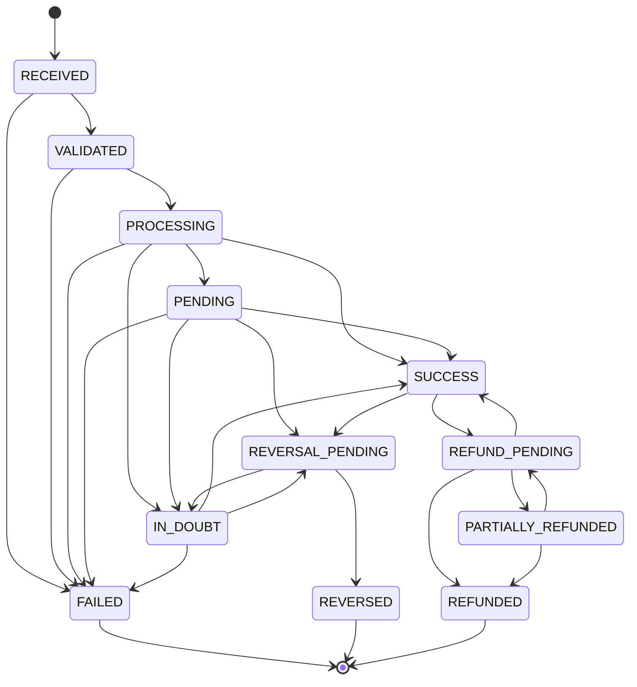
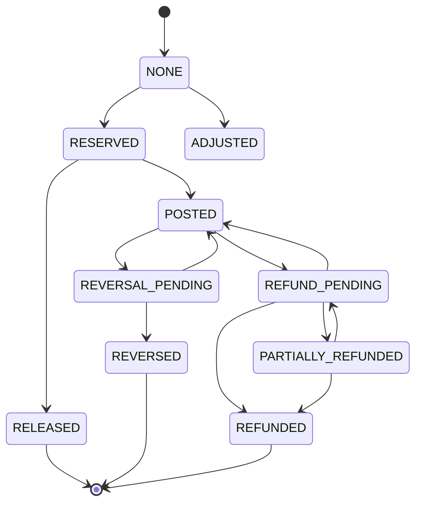
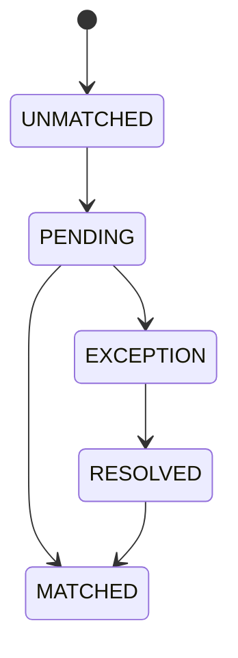
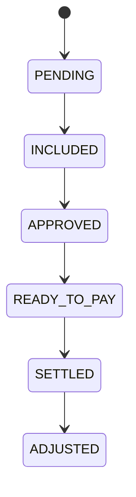

# RANSYS Transaction State Transition Matrix v1.0

**Document Type:** Detailed Engineering Design — State Machine  
**Product:** RANSYS Universal Transaction Switching & Processing Platform  
**Status:** Draft v1 for engineering review  
**Depends On:** RANSYS PRD v1.0, Database ERD v1.0, Ledger Posting Rule Matrix v1.0

---

# 1. Purpose

Dokumen ini menentukan:

- state yang boleh digunakan;
- state transition yang valid;
- trigger setiap transition;
- financial precondition;
- reservation/ledger action;
- invalid transition behavior;
- interaction antara online processing, ledger, reconciliation, dan settlement.

Tujuan utama adalah mencegah:

```text
silent state overwrite
double financial finalization
release hold yang salah
late callback mengubah truth
reconciliation menimpa online state secara tidak aman
```

---

# 2. State Model Refinement

PRD awal mendefinisikan generic state:

```text
RECEIVED
VALIDATED
PROCESSING
PENDING
IN_DOUBT
SUCCESS
FAILED
REVERSAL_PENDING
REVERSED
REFUND_PENDING
REFUNDED
RECON_PENDING
RECON_EXCEPTION
```

Pada detailed engineering design, state tersebut perlu dipisahkan menjadi **empat orthogonal dimensions**:

```text
processing_status
financial_status
reconciliation_status
settlement_status
```

Reason:

```text
processing_status     = SUCCESS
financial_status      = POSTED
reconciliation_status = EXCEPTION
settlement_status     = PENDING
```

adalah kondisi valid.

Jika semuanya dipaksa menjadi satu enum, `SUCCESS` dapat tertimpa oleh `RECON_EXCEPTION` padahal online processing sebenarnya tetap sukses.

---

# 3. Recommended Persistent State Dimensions

## 3.1 `processing_status`

```text
RECEIVED
VALIDATED
PROCESSING
PENDING
IN_DOUBT
SUCCESS
FAILED
REVERSAL_PENDING
REVERSED
REFUND_PENDING
PARTIALLY_REFUNDED
REFUNDED
```

## 3.2 `financial_status`

```text
NONE
RESERVED
POSTED
RELEASED
REVERSAL_PENDING
REVERSED
REFUND_PENDING
PARTIALLY_REFUNDED
REFUNDED
ADJUSTED
```

## 3.3 `reconciliation_status`

```text
UNMATCHED
PENDING
MATCHED
EXCEPTION
RESOLVED
```

## 3.4 `settlement_status`

```text
NOT_APPLICABLE
PENDING
INCLUDED
APPROVED
READY_TO_PAY
SETTLED
ADJUSTED
```

---

# 4. External Composite Status

External API may still expose one `transactionStatus`.

It is a derived view, not necessarily one database column.

Example mapping:

```text
processing_status = IN_DOUBT
financial_status  = RESERVED

external transactionStatus = IN_DOUBT
```

```text
processing_status     = SUCCESS
reconciliation_status = EXCEPTION

external realtime transactionStatus = SUCCESS
Backoffice reconStatus              = EXCEPTION
```

Do not change merchant realtime result to `FAILED` only because reconciliation is pending.

---

# 5. State Transition General Rules

1. State transition dilakukan oleh Transaction Core or controlled financial workflow.
2. Provider Adapter tidak langsung update state DB.
3. Every transition menghasilkan `transaction_state_history`.
4. Financial transition menghasilkan ledger action jika applicable.
5. Same event retry harus idempotent.
6. Late/out-of-order event tidak boleh mundur ke state yang lebih lemah.
7. Historical state history append-only.
8. `reason_code` menjelaskan kenapa transition terjadi.
9. Transition invalid harus ditolak dan dicatat.
10. Manual action tidak boleh direct force status.

---

# 6. Processing State Diagram



`REFUND_PENDING -> SUCCESS` means refund request itself failed/declined and original transaction remains successfully completed.

---

# 7. PS-01 — Create Transaction

## From

```text
NONE
```

## To

```text
RECEIVED
```

## Trigger

Valid transport request has entered RANSYS far enough to create a business transaction identity.

## Actions

```text
generate ransys_transaction_id
create transaction
create initial state history
```

## Financial

```text
financial_status = NONE
```

No reserve yet.

---

# 8. PS-02 — Validation Success

## From

```text
RECEIVED
```

## To

```text
VALIDATED
```

Validation includes:

```text
merchant/channel validity
product validity
request schema
auth policy result if transaction already created
duplicate/idempotency
amount validation
config availability
```

No provider call yet.

---

# 9. PS-03 — Validation Failure

## From

```text
RECEIVED
VALIDATED (only if later pre-processing rule fails)
```

## To

```text
FAILED
```

Examples:

```text
INVALID_PRODUCT
INVALID_REQUEST
INSUFFICIENT_BALANCE
NO_ROUTE_AVAILABLE before provider send
```

If no reservation was created:

```text
financial_status = NONE
```

If reservation had already been created due to later pre-provider failure:

```text
release reservation atomically
financial_status = RELEASED
```

---

# 10. PS-04 — Start Provider Processing

## From

```text
VALIDATED
```

## To

```text
PROCESSING
```

## Preconditions

For financial transaction:

```text
transaction record committed
wallet reserve committed
financial_status = RESERVED
```

For non-financial inquiry:

```text
no wallet reservation required
```

Provider call occurs outside wallet lock transaction.

---

# 11. PS-05 — Provider Success

## From

```text
PROCESSING
PENDING
IN_DOUBT
```

## To

```text
SUCCESS
```

## Trigger

Definitive provider result through:

```text
sync response
status check
callback/webhook
advice
deterministic reconciliation
```

## Financial Preconditions

If transaction requires financial debit:

```text
financial_status = RESERVED
```

## Ledger

Execute idempotent:

```text
POST
```

## Result

```text
financial_status = POSTED
```

---

# 12. PS-06 — Provider Definitive Failure

## From

```text
PROCESSING
PENDING
IN_DOUBT
```

## To

```text
FAILED
```

## Trigger

Definitive proof:

```text
decline
status check confirms failed/not processed
reconciliation proves not processed
```

## Financial

If reservation exists:

```text
RELEASE
financial_status = RELEASED
```

If no reservation:

```text
financial_status = NONE
```

---

# 13. PS-07 — Provider Explicit Pending

## From

```text
PROCESSING
```

## To

```text
PENDING
```

Provider explicitly states:

```text
still processing
pending
accepted for asynchronous result
```

Financial reservation stays:

```text
financial_status = RESERVED
```

No release.

---

# 14. PS-08 — Ambiguous Timeout

## From

```text
PROCESSING
PENDING
REVERSAL_PENDING
```

## To

```text
IN_DOUBT
```

Use only when RANSYS cannot prove final provider result.

Typical trigger:

```text
read timeout after request sent
connection reset after request possibly sent
reversal request result also ambiguous
```

Financial:

```text
reservation remains
financial_status = RESERVED
```

or, if original transaction had already been posted before reversal ambiguity:

```text
financial_status remains POSTED or REVERSAL_PENDING
```

Do not automatically release.

---

# 15. Connection Error Before Request Sent

This case is **not** `IN_DOUBT`.

If:

```text
request_sent = false
```

RANSYS knows provider did not receive the financial message.

Possible action:

```text
route/failover to next provider
```

Processing can remain:

```text
PROCESSING
```

with a new `transaction_attempt`.

If no route remains:

```text
FAILED
+ release reserve
```

This distinction must be explicit in `transaction_attempts.request_sent`.

---

# 16. PS-09 — Start Reversal

## From

```text
PENDING
IN_DOUBT
SUCCESS
```

## To

```text
REVERSAL_PENDING
```

Two different financial scenarios exist.

### A. Original not yet posted

```text
financial_status = RESERVED
```

Successful reversal will release reservation.

### B. Original already posted

```text
financial_status = POSTED
```

Successful reversal will create compensating ledger posting.

---

# 17. PS-10 — Reversal Success

## From

```text
REVERSAL_PENDING
```

## To

```text
REVERSED
```

### If reservation still active

Ledger:

```text
RELEASE
```

Financial:

```text
RESERVED -> RELEASED
```

### If original payment already posted

Ledger:

```text
REVERSAL compensating posting
```

Financial:

```text
POSTED -> REVERSED
```

Original ledger record remains untouched.

---

# 18. Reversal Definitive Failure

A reversal failure does **not automatically mean the original transaction failed**.

If original is known `SUCCESS`:

```text
processing_status should return/remain SUCCESS
financial_status remains POSTED
```

Record:

```text
reversal attempt = FAILED
reason_code = REVERSAL_DECLINED
```

If original truth is still ambiguous:

```text
processing_status = IN_DOUBT
```

and continue recovery/reconciliation.

Do not set original transaction `FAILED` merely because reversal failed.

---

# 19. PS-11 — Start Refund

Refund should ideally be its own transaction type referencing:

```text
original_transaction_id
```

For a summary view on original transaction:

```text
SUCCESS -> REFUND_PENDING
```

may be exposed.

Financial original posting remains immutable.

Refund transaction has its own:

```text
ransys_transaction_id
idempotency
attempts
provider result
ledger posting
```

---

# 20. PS-12 — Full Refund Success

Original transaction aggregate view:

```text
REFUND_PENDING -> REFUNDED
```

Financial:

```text
financial_status = REFUNDED
```

New compensating refund ledger posting is created.

---

# 21. PS-13 — Partial Refund Success

```text
REFUND_PENDING -> PARTIALLY_REFUNDED
```

Financial:

```text
financial_status = PARTIALLY_REFUNDED
```

Further refund may transition:

```text
PARTIALLY_REFUNDED -> REFUND_PENDING
```

then:

```text
REFUNDED
```

when refundable amount is exhausted.

---

# 22. Refund Failure

Refund failure must not convert original payment to `FAILED`.

Original returns/remains:

```text
SUCCESS
```

or:

```text
PARTIALLY_REFUNDED
```

depending prior successful refunds.

Refund child transaction records failure independently.

---

# 23. Financial Status Diagram



---

# 24. FS-01 — NONE -> RESERVED

Trigger:

```text
atomic wallet reserve succeeds
```

Required:

```text
ledger RESERVE posting
balance_reservation ACTIVE
```

---

# 25. FS-02 — RESERVED -> POSTED

Trigger:

```text
definitive provider success
```

Required:

```text
reservation ACTIVE -> COMMITTED
ledger POST
wallet reserved decreases
wallet ledger balance decreases
```

---

# 26. FS-03 — RESERVED -> RELEASED

Trigger:

```text
definitive failure
successful reversal before final posting
authorized release after proven not processed
```

Required:

```text
reservation ACTIVE -> RELEASED
ledger RELEASE
available restored
```

---

# 27. FS-04 — POSTED -> REVERSAL_PENDING

No balance mutation yet solely because reversal was requested.

Financial original remains economically posted until reversal success.

Use separate flag/status:

```text
REVERSAL_PENDING
```

---

# 28. FS-05 — REVERSAL_PENDING -> REVERSED

Successful compensating posting.

Required:

```text
new REVERSAL ledger_transaction
compensates original POST
```

---

# 29. FS-06 — POSTED -> REFUND_PENDING

Refund initiated.

No credit to merchant until refund business rule reaches approved/success posting point.

---

# 30. FS-07 — REFUND_PENDING -> PARTIALLY_REFUNDED

One or more partial refund postings succeeded.

Persist cumulative:

```text
refunded_principal
refunded_fee
remaining_refundable_amount
```

or calculate from refund child transactions.

---

# 31. FS-08 — REFUND_PENDING/PARTIAL -> REFUNDED

Full refundable amount completed.

---

# 32. Reconciliation State Diagram



`MATCHED` means recon evidence agrees according to provider matching strategy.

---

# 33. RS-01 — UNMATCHED

Default after eligible financial transaction is posted or requires reconciliation.

Not an error.

---

# 34. RS-02 — PENDING

Recon batch/real-time recon is actively evaluating transaction.

Online processing must not stop because reconciliation is pending.

---

# 35. RS-03 — MATCHED

Examples:

```text
amount match
reference match
status match
```

according to provider-specific matching strategy.

No ledger action if online financial state is already correct.

---

# 36. RS-04 — EXCEPTION

Normalized cases include:

```text
RANSYS_ONLY
PROVIDER_ONLY
AMOUNT_MISMATCH
STATUS_MISMATCH
DUPLICATE_PROVIDER
REFERENCE_MISMATCH
```

No automatic ledger adjustment for non-deterministic mismatch.

---

# 37. RS-05 — RESOLVED

Exception has a recorded resolution.

If resolution required financial adjustment:

```text
maker-checker
new ledger transaction
audit trail
```

Then reconciliation may become:

```text
MATCHED
```

or stay `RESOLVED` depending reporting design.

---

# 38. Deterministic Reconciliation Resolution

Example:

```text
processing_status     = IN_DOUBT
financial_status      = RESERVED
provider recon status = SUCCESS
reference             = MATCH
amount                = MATCH
```

Allowed:

```text
processing_status     -> SUCCESS
financial_status      -> POSTED
reconciliation_status -> MATCHED
```

Transaction Core/Ledger Service performs posting.

Recon Engine does not directly write ledger entries.

---

# 39. Reconciliation Proves Failure

Example:

```text
IN_DOUBT
provider file proves NOT_PROCESSED
```

Allowed:

```text
processing_status = FAILED
financial_status  = RELEASED
reconciliation_status = MATCHED/RESOLVED
```

Release is performed through Ledger Posting Service.

---

# 40. Reconciliation Amount Mismatch

Example:

```text
RANSYS amount   = 100,000
Provider amount = 150,000
```

Result:

```text
reconciliation_status = EXCEPTION
```

Do not:

```text
change amount
change ledger
force SUCCESS/FAILED
```

without investigation.

---

# 41. Settlement State Diagram



Settlement remains asynchronous and does not control realtime transaction availability.

---

# 42. SS-01 — PENDING

Transaction is financially eligible but not yet assigned/finalized into settlement period.

---

# 43. SS-02 — INCLUDED

Transaction included in settlement batch according to:

```text
cutoff
business date
holiday calendar
provider/product rule
```

---

# 44. SS-03 — APPROVED

Settlement batch passed maker-checker review.

---

# 45. SS-04 — READY_TO_PAY

Calculation approved and ready for external payout/finance system.

Actual payout remains outside baseline RANSYS scope.

---

# 46. SS-05 — SETTLED

External confirmation indicates settlement completed, if such feedback is integrated.

---

# 47. SS-06 — ADJUSTED

Correction after business-date closing.

Historical settlement item is not silently edited; use adjustment record.

---

# 48. Composite State Examples

## Happy Path

```text
processing_status     = SUCCESS
financial_status      = POSTED
reconciliation_status = UNMATCHED
settlement_status     = PENDING
```

Later:

```text
processing_status     = SUCCESS
financial_status      = POSTED
reconciliation_status = MATCHED
settlement_status     = SETTLED
```

---

# 49. Timeout Example

```text
processing_status     = IN_DOUBT
financial_status      = RESERVED
reconciliation_status = UNMATCHED
settlement_status     = NOT_APPLICABLE/PENDING_NOT_ELIGIBLE
```

No settlement inclusion until financial truth satisfies settlement rule.

---

# 50. Recon Exception Example

```text
processing_status     = SUCCESS
financial_status      = POSTED
reconciliation_status = EXCEPTION
settlement_status     = PENDING
```

This is why recon state must not overwrite processing state.

---

# 51. Reversed Example

```text
processing_status     = REVERSED
financial_status      = REVERSED
reconciliation_status = UNMATCHED/MATCHED
settlement_status     = ADJUSTED or excluded based rule
```

---

# 52. Invalid Transition Policy

If system receives invalid transition request:

Example:

```text
FAILED -> SUCCESS
```

without approved recovery evidence.

System must:

```text
REJECT transition
write application/security/audit event as applicable
increment invalid_transition metric
```

Never silently accept.

---

# 53. Late Success After Failed State

This is a serious edge case.

If RANSYS already marked `FAILED` only because it had definitive proof, a later SUCCESS should be treated as:

```text
PROVIDER_CONTRADICTION
RECON_EXCEPTION
```

not automatic `FAILED -> SUCCESS`.

If the previous `FAILED` was incorrectly assigned from timeout, that is a bug because timeout should have been `IN_DOUBT`.

This rule reinforces:

```text
TIMEOUT != FAILED
```

---

# 54. Late Failure After Success

If transaction already:

```text
SUCCESS + POSTED
```

and a later provider message says FAILED:

Do not:

```text
SUCCESS -> FAILED
release wallet
```

Create:

```text
RECON_EXCEPTION / PROVIDER_CONTRADICTION
```

Investigate or execute formal reversal if supported.

---

# 55. Duplicate Callback — Same Result

If current:

```text
SUCCESS
```

and duplicate SUCCESS arrives:

```text
NO STATE CHANGE
NO LEDGER POSTING
record delivery/attempt history
```

Idempotent response.

---

# 56. Duplicate Callback — Conflicting Result

If current:

```text
SUCCESS
```

callback says:

```text
FAILED
```

Result:

```text
reconciliation_status = EXCEPTION
reason = CONFLICTING_PROVIDER_RESULT
```

No automatic financial mutation.

---

# 57. State Versioning / Optimistic Concurrency

Recommended `transactions.row_version`.

State update pattern:

```text
UPDATE transactions
SET ...
    row_version = row_version + 1
WHERE ransys_transaction_id = :id
  AND row_version = :expected
  AND processing_status IN (:allowed_from);
```

If affected row = 0:

```text
reload state
evaluate idempotency/conflict
```

This protects against concurrent callback/status-check/recon processing.

Financial wallet lock remains separate and stronger.

---

# 58. Locking Guidance for Finalization

Recommended controlled order:

```text
1. transaction row
2. wallet row
3. reservation row
4. ledger posting key check
```

All financial finalization code paths should follow the same order.

No provider I/O inside the DB transaction.

---

# 59. State History Record

Every real transition stores:

```text
history_id
ransys_transaction_id
transaction_attempt_id
previous_status
new_status
reason_code
reason_description
change_source
created_at
```

Possible `change_source`:

```text
CORE
SYNC_PROVIDER_RESPONSE
CALLBACK
STATUS_CHECK
ADVICE
RECONCILIATION
MANUAL_ACTION
SYSTEM_RECOVERY
```

---

# 60. No-op Event History

Duplicate same-result callback should generally not create a fake state transition.

Instead record in:

```text
transaction_attempt / callback delivery history / audit
```

State history should represent actual state changes.

---

# 61. Reason Code Examples

```text
VALIDATION_FAILED
INSUFFICIENT_BALANCE
NO_ROUTE_AVAILABLE
PROVIDER_DECLINED
PROVIDER_READ_TIMEOUT
PROVIDER_EXPLICIT_PENDING
STATUS_CHECK_SUCCESS
STATUS_CHECK_FAILED
REVERSAL_CONFIRMED
REVERSAL_DECLINED
RECON_CONFIRMED_SUCCESS
RECON_CONFIRMED_FAILURE
RECON_AMOUNT_MISMATCH
CONFLICTING_PROVIDER_RESULT
MANUAL_RELEASE_APPROVED
```

Reason code catalog should be versioned separately from primary state enum.

---

# 62. Outbox Events per Transition

Suggested:

| Transition | Outbox Event |
|---|---|
| RECEIVED -> VALIDATED | optional `TRANSACTION_VALIDATED` |
| VALIDATED -> PROCESSING | `TRANSACTION_PROCESSING` |
| PROCESSING -> SUCCESS | `TRANSACTION_SUCCEEDED` |
| PROCESSING -> FAILED | `TRANSACTION_FAILED` |
| PROCESSING -> PENDING | `TRANSACTION_PENDING` |
| PROCESSING -> IN_DOUBT | `TRANSACTION_IN_DOUBT` |
| IN_DOUBT -> SUCCESS | `TRANSACTION_RESOLVED_SUCCESS` |
| IN_DOUBT -> FAILED | `TRANSACTION_RESOLVED_FAILED` |
| -> REVERSAL_PENDING | `REVERSAL_REQUESTED` |
| -> REVERSED | `TRANSACTION_REVERSED` |
| -> REFUNDED | `TRANSACTION_REFUNDED` |
| recon EXCEPTION | `RECON_EXCEPTION_CREATED` |

Events are at-least-once and consumers must be idempotent.

---

# 63. Merchant Callback Rules

Callback should be emitted for business-relevant final/asynchronous changes.

Example:

```text
IN_DOUBT -> SUCCESS
IN_DOUBT -> FAILED
PENDING  -> SUCCESS
PENDING  -> FAILED
REVERSAL_PENDING -> REVERSED
REFUND_PENDING -> REFUNDED
```

Do not callback internal/no-op duplicate transitions.

---

# 64. Provider Attempt Relationship

Processing state is aggregate truth.

`transaction_attempts` records network truth.

Example:

```text
Attempt 1:
Provider A
request_sent = false
CONNECTION_ERROR

Attempt 2:
Provider B
request_sent = true
TIMEOUT

Aggregate:
processing_status = IN_DOUBT
actual_provider = B
```

Attempts are immutable operational history.

---

# 65. Failover State Behavior

Before-send failure:

```text
PROCESSING remains PROCESSING
new attempt created
```

No need to toggle transaction back to `VALIDATED`.

After-send ambiguity:

```text
PROCESSING -> IN_DOUBT
```

No new purchase attempt to another provider.

---

# 66. Provider Manual Disable

Provider state change does not retroactively change active transaction state.

New transactions:

```text
routing skips MANUAL_DISABLED provider
```

Existing `IN_DOUBT` transaction on disabled provider must still allow:

```text
status check
reversal
reconciliation
```

if technical connectivity/capability permits.

---

# 67. Circuit Breaker Interaction

Circuit breaker affects creation of new provider attempts.

It does not itself set financial transaction to FAILED.

If primary circuit is open before send:

```text
try secondary provider
```

If no provider:

```text
FAILED
release reservation
reason = NO_ROUTE_AVAILABLE / PROVIDER_LINK_DOWN
```

provided no financial request was sent.

---

# 68. Configuration Version Rule

Transaction stores:

```text
config_version
routing_rule_version
fee_rule_version
provider_policy_version
```

State recovery uses captured transaction financial terms.

Do not recalculate historical fee using newest config.

---

# 69. Transaction State and Business-Date Closing

Business-date closing does not alter processing state.

A transaction can be:

```text
SUCCESS
```

before settlement/recon closing.

Correction after closing uses:

```text
adjustment
reversal
refund
recon resolution
```

not historical state edit.

---

# 70. Manual Release Hold

Manual release is only allowed after operational/financial evidence and approval workflow.

It is not:

```text
"change IN_DOUBT to FAILED"
```

Instead:

```text
create authorized compensating action
release reservation through LedgerPostingService
record reason/approval
transition according to proven truth
```

If truth remains unknown, release should create a financial exception requiring explicit risk ownership.

---

# 71. Manual Status Change Prohibition

Backoffice must not expose:

```text
Force SUCCESS
Force FAILED
```

Allowed actions:

```text
Status Check
Requery
Manual Reversal
Refund
Release Hold
Recon Resolution
Financial Adjustment
```

Each action has actual domain semantics.

---

# 72. State Machine Test Matrix

Mandatory tests:

1. RECEIVED -> VALIDATED.
2. RECEIVED -> FAILED invalid request.
3. VALIDATED -> PROCESSING with successful reserve.
4. concurrent same-wallet reserve.
5. PROCESSING -> SUCCESS.
6. PROCESSING -> FAILED.
7. PROCESSING -> PENDING -> SUCCESS.
8. PROCESSING -> IN_DOUBT.
9. IN_DOUBT -> SUCCESS via status check.
10. IN_DOUBT -> FAILED via recon.
11. IN_DOUBT -> REVERSAL_PENDING -> REVERSED.
12. SUCCESS -> REVERSAL_PENDING -> REVERSED.
13. duplicate success callback.
14. success then conflicting failure callback.
15. failed then contradictory provider success.
16. partial refund.
17. full refund.
18. duplicate refund request.
19. out-of-order callback after recon.
20. Transaction Core restart during IN_DOUBT recovery.

---

# 73. State Transition Reference Table

| From | To | Allowed | Financial Action |
|---|---|---:|---|
| NONE | RECEIVED | Yes | None |
| RECEIVED | VALIDATED | Yes | None |
| RECEIVED | FAILED | Yes | None |
| VALIDATED | PROCESSING | Yes | Reserve already committed for financial tx |
| VALIDATED | FAILED | Yes | Release if reserve exists |
| PROCESSING | SUCCESS | Yes | POST |
| PROCESSING | FAILED | Yes | RELEASE |
| PROCESSING | PENDING | Yes | Hold |
| PROCESSING | IN_DOUBT | Yes | Hold |
| PENDING | SUCCESS | Yes | POST |
| PENDING | FAILED | Yes | RELEASE |
| PENDING | IN_DOUBT | Yes | Hold |
| IN_DOUBT | SUCCESS | Yes | POST |
| IN_DOUBT | FAILED | Yes, with definitive proof | RELEASE |
| IN_DOUBT | REVERSAL_PENDING | Yes | Hold |
| REVERSAL_PENDING | REVERSED | Yes | RELEASE or REVERSAL |
| REVERSAL_PENDING | IN_DOUBT | Yes | Preserve current financial truth |
| SUCCESS | REVERSAL_PENDING | Yes | No immediate posting |
| SUCCESS | REFUND_PENDING | Yes | No immediate refund posting |
| REFUND_PENDING | PARTIALLY_REFUNDED | Yes | REFUND |
| REFUND_PENDING | REFUNDED | Yes | REFUND |
| REFUND_PENDING | SUCCESS | Yes if refund failed | None |
| FAILED | SUCCESS | No direct | Recon exception |
| SUCCESS | FAILED | No direct | Recon exception |
| REVERSED | SUCCESS | No direct | New explicit action required |
| REFUNDED | SUCCESS | No direct | New explicit action required |

---

# 74. Recommended ERD Refinements From State Design

State design suggests:

1. Keep separate status columns:
   - `processing_status`
   - `financial_status`
   - `reconciliation_status`
   - `settlement_status`
2. Add `row_version` if not already present.
3. Persist provider/config/fee policy versions.
4. Treat refund as child transaction with `original_transaction_id`.
5. Add cumulative refund view/projection or derive safely.
6. Store reversal/refund attempts in `transaction_attempts`.
7. Keep `RECON_PENDING`/`RECON_EXCEPTION` out of persistent `processing_status`; represent them in `reconciliation_status`.
8. External API can derive composite `transactionStatus` where needed.

---

# 75. Compatibility With Original PRD Generic States

For documentation compatibility:

```text
Original RECON_PENDING
-> processing_status unchanged
-> reconciliation_status = PENDING

Original RECON_EXCEPTION
-> processing_status unchanged
-> reconciliation_status = EXCEPTION
```

This preserves the business concept while avoiding contradictory database state.

---

# 76. Next Engineering Artifacts

Recommended next:

```text
01 Payment SUCCESS Sequence Diagram
02 Provider Timeout -> IN_DOUBT Sequence Diagram
03 Status Check Recovery Sequence Diagram
04 Reversal Sequence Diagram
05 Refund Sequence Diagram
06 Duplicate Request Sequence Diagram
07 Reconciliation Sequence Diagram
```

These diagrams should reference exact DB tables, locks, ledger posting keys, transaction attempts, and outbox events defined by ERD + Ledger Matrix.

---

# 77. Final State Principle

> **A RANSYS transaction does not have one simplistic status. It has an online processing truth, a financial truth, a reconciliation truth, and a settlement truth. Each dimension changes only through explicit, validated, auditable transitions.**
